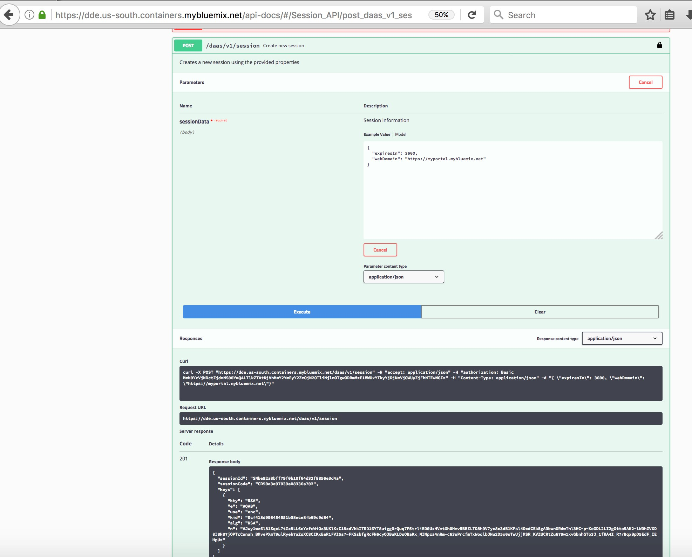

---

copyright:
  years: 2019
lastupdated: "2019-02-13"
---

{:new_window: target="_blank"}
{:shortdesc: .shortdesc}
{:screen: .screen}
{:codeblock: .codeblock}
{:pre: .pre}

# Encrypting data source information
{: #encryptingdatasourceinformation}

When applications use {{site.data.keyword.dynamdashbemb_full}}, they provide data source modules (JSON documents) to describe the metadata of the data that they want {{site.data.keyword.dynamdashbemb_short}} to query. Part of this information is the database connection and credential information.

To provide a secure way to pass this information from the embedding application to {{site.data.keyword.dynamdashbemb_short}}, and keep the plain text of these sensitive fields out of the browser, you must ensure that the calling application does things that are described in this section.

When your embedding application creates a session, a public encryption key, in JSON Web Key format, is returned. 
For more information on a {{site.data.keyword.dynamdashbemb_short}} session, see [Getting started tutorial](/docs/services/cognos-dashboard-embedded/dde_getting_started.html#step3).
For information on JSON Web Key, see [JSON Web Key](https://tools.ietf.org/html/rfc7517).

Public encryption key in JSON Web Key format:


When the embedding application provides a data source module specification, then the calling application provides a module to {{site.data.keyword.dynamdashbemb_short}}, for exampling with the methods *addSources()* or *updateModuleDefinitions()*, then you can choose to provide any of the following fields in an encrypted form:
-	user
-	password
-	schema
-	jdbcUrl
-	sourceUrl
- value of a header property for CSV urls

Before sending the module, your application uses the public key to encrypt the sensitive fields of the module.

If you have a string to encrypt that is longer than 245 bytes, then do the following steps:
1.  Divide the string that you want to encrypt in parts that are a maximum of 245 bytes.
1.  Encrypt the parts from step 1 and make sure the are base64 encoded.
1.  Concatenate the encode parts from step 2 with the colon ":" character.
1.  Use the value from step 3 in the encrypted field.

Example of a JDBCurl:

```bash
{"enc}f1JwT6s3TT5ml+Ir7Y1ndRA8J4zq/KMVlgYGP44k9DxOiSiLEJ82giOvP86lHIDgiOM6zmZ5rN6j6/pRdlFnA/f5UiKj0gDx2LKViyEXyMyptQwDOfs8Lk2qPjM0G8M1WiPHvOVT6iYezgOv04DhNclIVwxAncPBvrUfMi3N5ZgyBrN5gyg/h/bCLQvIBkrcIaSnUHK2Uij6nDfcsPROHjpjI5KX24sHUFbNMkGPfyDsxHUw5ukFxyY3rV4MSHgBsDlq03qKTpnaFCUKAdybpolxA64i8cI0DW1stMpTa5QbuRodnZxa/9cj0QMokzmCNFnvyrHro8gI2TPCAkJLZw==:f1JwT6s3TT5ml+Ir7Y1ndRA8J4zq/KMVlgYGP44k9DxOiSiLEJ82giOvP86lHIDgiOM6zmZ5rN6j6/pRdlFnA/f5UiKj0gDx2LKViyEXyMyptQwDOfs8Lk2qPjM0G8M1WiPHvOVT6iYezgOv04DhNclIVwxAncPBvrUfMi3N5ZgyBrN5gyg/h/bCLQvIBkrcIaSnUHK2Uij6nDfcsPROHjpjI5KX24sHUFbNMkGPfyDsxHUw5ukFxyY3rV4MSHgBsDlq03qKTpnaFCUKAdybpolxA64i8cI0DW1stMpTa5QbuRodnZxa/9cj0QMokzmCNFnvyrHro8gI2TPCAkJLZw=="
```

**Note:** This key is only valid during the session.

Use the prefix *{enc}* on encrypted field values. For example: "password" : "{enc}encryptedpassword". Encrypted values are Base64 encoded.

**Note:** When starting a new session, you must re-encrypt sensitive information that is contained in modules. Before you encrypt these fields, you must update the data sources.  Update the data sources by calling the *updateModuleDefinitions()* method. 

For more information on using the *updateModuleDefinitions()* method, see [Updating data source information](/docs/services/cognos-dashboard-embedded/ddeusecase_updatedatasourceinfo.html#updating_data_source_information).

Update all modules with the encrypted fields, by using the encryption key of this session.
