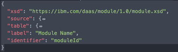
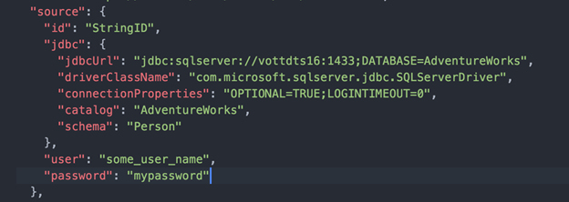
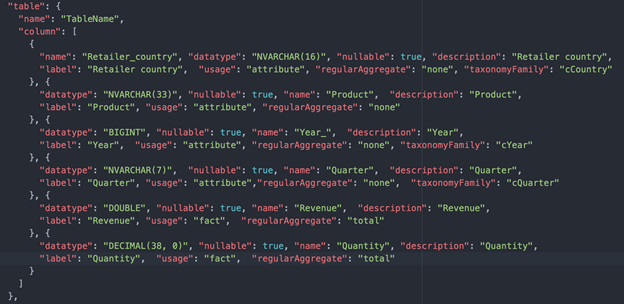

---

copyright:
  years: 2018, 2019
lastupdated: "2019-04-11"

keywords: data source, addsource, method, adding

subcollection: cognos-dashboard-embedded

---

{:new_window: target="_blank"}
{:shortdesc: .shortdesc}
{:screen: .screen}
{:codeblock: .codeblock}
{:pre: .pre}

# Working with data sources
{: #workingwithdatasources}

**Note:** If the database that you use is case-sensitive, then make sure to use the correct casing in {{site.data.keyword.dynamdashbemb_full}}.

## Adding new data sources with the *addSource()* method
{: #addingnewdatasources}

You can add a new data source to a dashboard in {{site.data.keyword.dynamdashbemb_short}}, by calling the addSources() method:

```bash
dashboardAPI.addSources([{
  module: sampleModule,
  name: 'Test Source',
  id: 'myUniqueId123'
}])
```    
{: pre}

The *name* is how the data source appears in the metadata tree, in the dashboard source pane. 

The *id* can be anything that you want. Use the ID to reference the data source in other method calls. For example, in the *updateModuleDefinitions()* method.

The *module* is where the data source location, credentials, and format are described. The module is passed as a JavaScript object that conforms to the following schema:

```bash
<?xml version="1.0" encoding="UTF-8"?>
<!--
 Licensed Materials - Property of IBM

 (C) Copyright IBM Corp. 2018

 US Government Users Restricted Rights - Use, duplication or disclosure restricted by GSA ADP Schedule Contract with IBM Corp.
-->
<xsd:schema xmlns:xsd="http://www.w3.org/2001/XMLSchema" elementFormDefault="qualified" attributeFormDefault="unqualified" version="1.0">
	<xsd:element name="module">
		<xsd:annotation>
			<xsd:documentation>The single table module.</xsd:documentation>
		</xsd:annotation>
		<xsd:complexType>
			<xsd:sequence>
				<xsd:element name="xsd" type="xsd:string">
					<xsd:annotation>
						<xsd:documentation>Describes XSD this module is compliant: "https://ibm.com/daas/module/1.0/module.xsd"</xsd:documentation>
					</xsd:annotation>
				</xsd:element>
				<xsd:element ref="source"/>
				<xsd:element ref="table"/>
				<xsd:element name="label" type="xsd:string" minOccurs="0">
					<xsd:annotation>
						<xsd:documentation>Usefull to locate the module in UI</xsd:documentation>
					</xsd:annotation>
				</xsd:element>
				<xsd:element name="identifier" type="xsd:string">
					<xsd:annotation>
						<xsd:documentation>Required to identify the module for referencing</xsd:documentation>
					</xsd:annotation>
				</xsd:element>
			</xsd:sequence>
		</xsd:complexType>
	</xsd:element>
	<xsd:complexType name="propertyType">
		<xsd:annotation>
			<xsd:documentation>Generic property container.</xsd:documentation>
		</xsd:annotation>
		<xsd:sequence>
			<xsd:element name="name" type="xsd:string"/>
			<xsd:element name="value" type="xsd:string"/>
		</xsd:sequence>
	</xsd:complexType>
	<xsd:element name="source">
		<xsd:annotation>
			<xsd:documentation>Source of the data in the table.</xsd:documentation>
		</xsd:annotation>
		<xsd:complexType>
			<xsd:sequence>
				<xsd:element name="id" type="xsd:string">
					<xsd:annotation>
						<xsd:documentation>External id.</xsd:documentation>
					</xsd:annotation>
				</xsd:element>
				<xsd:choice>
					<xsd:element ref="jdbc" minOccurs="0"/>
					<xsd:element ref="srcUrl" minOccurs="0"/>
				</xsd:choice>
				<xsd:element name="user" type="xsd:string" minOccurs="0"/>
				<xsd:element name="password" type="xsd:string" minOccurs="0"/>
			</xsd:sequence>
		</xsd:complexType>
	</xsd:element>
	<xsd:element name="jdbc">
		<xsd:annotation>
			<xsd:documentation>Defines jdbc connection parameters.</xsd:documentation>
		</xsd:annotation>
		<xsd:complexType>
			<xsd:sequence>
				<xsd:element name="jdbcUrl" type="xsd:string"/>
				<xsd:element name="driverClassName" type="xsd:string" minOccurs="0"/>
				<xsd:element name="connectionProperties" type="xsd:string" minOccurs="0"/>
				<xsd:element name="catalog" type="xsd:string" minOccurs="0"/>
				<xsd:element name="schema" type="xsd:string" minOccurs="0"/>
			</xsd:sequence>
		</xsd:complexType>
	</xsd:element>
	<xsd:element name="srcUrl">
		<xsd:annotation>
			<xsd:documentation>Defines URI source parameters.</xsd:documentation>
		</xsd:annotation>
		<xsd:complexType>
			<xsd:sequence>
				<xsd:element name="sourceUrl" type="xsd:string"/>
				<xsd:element name="mimeType" type="mimeType"/>
				<xsd:element name="property" type="propertyType" minOccurs="0" maxOccurs="unbounded"/>
			</xsd:sequence>
		</xsd:complexType>
	</xsd:element>
	<xsd:element name="table">
		<xsd:annotation>
			<xsd:documentation>Represents a table.</xsd:documentation>
		</xsd:annotation>
		<xsd:complexType>
			<xsd:complexContent>
				<xsd:extension base="namedObjectType">
					<xsd:sequence>
						<xsd:element ref="column" maxOccurs="unbounded">
							<xsd:annotation>
								<xsd:documentation>Table columns.</xsd:documentation>
							</xsd:annotation>
						</xsd:element>
					</xsd:sequence>
				</xsd:extension>
			</xsd:complexContent>
		</xsd:complexType>
	</xsd:element>
	<xsd:element name="column">
		<xsd:annotation>
			<xsd:documentation>The column.</xsd:documentation>
		</xsd:annotation>
		<xsd:complexType>
			<xsd:complexContent>
				<xsd:extension base="namedObjectType">
					<xsd:sequence>
						<xsd:element name="datatype" type="xsd:string">
							<xsd:annotation>
								<xsd:documentation>
									<para>Full data type. e,g, VARCHAR(20).</para>
									<para>ARRAY</para>
									<para>BIGINT</para>
									<para>BINARY</para>
									<para>BIT</para>
									<para>BLOB</para>
									<para>BOOLEAN</para>
									<para>CHAR   precision is used as length: CHAR(N)</para>
									<para>CLOB</para>
									<para>DATALINK</para>
									<para>DATE</para>
									<para>DECIMAL precision and scale are used: DECIMAL(N, M)</para>
									<para>DISTINCT user defined type</para>
									<para>DOUBLE</para>
									<para>FLOAT</para>
									<para>INTEGER</para>
									<para>JAVA_OBJECT</para>
									<para>LONGNVARCHAR see CHAR</para>
									<para>LONGVARBINARY see CHAR</para>
									<para>LONGVARCHAR see CHAR</para>
									<para>NCHAR  see CHAR</para>
									<para>NCLOB</para>
									<para>NULL</para>
									<para>NUMERIC see DECIMAL</para>
									<para>NVARCHAR  see CHAR</para>
									<para>OTHER</para>
									<para>REAL</para>
									<para>REF</para>
									<para>ROWID</para>
									<para>SMALLINT</para>
									<para>SQLXML</para>
									<para>STRUCT</para>
									<para>TIME</para>
									<para>TIMESTAMP</para>
									<para>TINYINT</para>
									<para>VARBINARY see CHAR</para>
									<para>VARCHAR see CHAR</para>
									<para>TIMESTAMP_TZ</para>
									<para>TIME_TZ</para>
									<para>INTERVAL_YEAR</para>
									<para>INTERVAL_YEAR_TO_MONTH</para>
									<para>INTERVAL_MONTH</para>
									<para>INTERVAL_DAY</para>
									<para>INTERVAL_DAY_TO_HOUR</para>
									<para>INTERVAL_DAY_TO_MINUTE</para>
									<para>INTERVAL_DAY_TO_SECOND</para>
									<para>INTERVAL_HOUR</para>
									<para>INTERVAL_HOUR_TO_MINUTE</para>
									<para>INTERVAL_HOUR_TO_SECOND</para>
									<para>INTERVAL_MINUTE</para>
									<para>INTERVAL_MINUTE_TO_SECOND</para>
									<para>INTERVAL_SECOND</para>
									<para>PERIOD_DATE</para>
									<para>PERIOD_TIME</para>
									<para>PERIOD_TIME_TZ</para>
									<para>PERIOD_TIMESTAMP</para>
									<para>PERIOD_TIMESTAMP_TZ</para>
									<para>JSON</para>
									<para>ROWSET</para>
								</xsd:documentation>
							</xsd:annotation>
						</xsd:element>
						<xsd:element name="nullable" type="xsd:boolean" default="false" minOccurs="0">
							<xsd:annotation>
								<xsd:documentation>If true, this object can contain NULL values.</xsd:documentation>
							</xsd:annotation>
						</xsd:element>
						<xsd:element name="label" type="xsd:string" default="" minOccurs="0">
							<xsd:annotation>
								<xsd:documentation>Pretty label for display.</xsd:documentation>
							</xsd:annotation>
						</xsd:element>
						<xsd:element name="usage" type="usageType" default="attribute" minOccurs="0">
							<xsd:annotation>
								<xsd:documentation>Usage of the column.</xsd:documentation>
							</xsd:annotation>
						</xsd:element>
						<xsd:element name="regularAggregate" type="regularAggregateType" default="none" minOccurs="0">
							<xsd:annotation>
								<xsd:documentation>Aggregation function applied to the column</xsd:documentation>
							</xsd:annotation>
						</xsd:element>
						<xsd:element name="taxonomyFamily" type="taxonomyFamilyType" minOccurs="0">
							<xsd:annotation>
								<xsd:documentation>Column taxonomy: category of the data.</xsd:documentation>
							</xsd:annotation>
						</xsd:element>
					</xsd:sequence>
				</xsd:extension>
			</xsd:complexContent>
		</xsd:complexType>
	</xsd:element>
	<xsd:simpleType name="usageType">
		<xsd:restriction base="xsd:NMTOKEN">
			<xsd:enumeration value="automatic">
				<xsd:annotation>
					<xsd:documentation>Specifies that the usage is not known.</xsd:documentation>
				</xsd:annotation>
			</xsd:enumeration>
			<xsd:enumeration value="identifier">
				<xsd:annotation>
					<xsd:documentation>Specifies that the object is to be treated as an identifier.</xsd:documentation>
				</xsd:annotation>
			</xsd:enumeration>
			<xsd:enumeration value="fact">
				<xsd:annotation>
					<xsd:documentation>Specifies that the object is to be treated as a fact.</xsd:documentation>
				</xsd:annotation>
			</xsd:enumeration>
			<xsd:enumeration value="attribute">
				<xsd:annotation>
					<xsd:documentation>Specifies that the object is to be treated as an attribute.</xsd:documentation>
				</xsd:annotation>
			</xsd:enumeration>
		</xsd:restriction>
	</xsd:simpleType>
	<xsd:simpleType name="regularAggregateType">
		<xsd:annotation>
			<xsd:documentation>The aggregation rule. same as V5 aggregate name. </xsd:documentation>
		</xsd:annotation>
		<xsd:restriction base="xsd:NMTOKEN">
			<xsd:enumeration value="none">
				<xsd:annotation>
					<xsd:documentation>This item should be used as a grouping item.</xsd:documentation>
				</xsd:annotation>
			</xsd:enumeration>
			<xsd:enumeration value="average">
				<xsd:annotation>
					<xsd:documentation>Compute the average value for the values of the group.</xsd:documentation>
				</xsd:annotation>
			</xsd:enumeration>
			<xsd:enumeration value="automatic">
				<xsd:annotation>
					<xsd:documentation>The aggregation rule is determined automatically at run time.</xsd:documentation>
				</xsd:annotation>
			</xsd:enumeration>
			<xsd:enumeration value="calculated">
				<xsd:annotation>
					<xsd:documentation>Aggregation is performed on the elements before the rest of the expression is executed. For example, if the aggregate rule for Q1_a is set to total, and the rule for q1_b is set to average, then if this query item is based on the expression (QI_a / QI_b) * 100, the aggregate is computed as: ( total(QI_a)  / average( QI_b ) ) * 100.
					</xsd:documentation>
				</xsd:annotation>
			</xsd:enumeration>
			<xsd:enumeration value="count">
				<xsd:annotation>
					<xsd:documentation>Compute the number of the values of the group.</xsd:documentation>
				</xsd:annotation>
			</xsd:enumeration>
			<xsd:enumeration value="countDistinct">
				<xsd:annotation>
					<xsd:documentation>Compute the number of distinct values in the group.</xsd:documentation>
				</xsd:annotation>
			</xsd:enumeration>
			<xsd:enumeration value="countNonZero">
				<xsd:annotation>
					<xsd:documentation>Compute the number of the values of the group, excluding zero and NULL values.</xsd:documentation>
				</xsd:annotation>
			</xsd:enumeration>
			<xsd:enumeration value="maximum">
				<xsd:annotation>
					<xsd:documentation>Compute the maximum value of the values of the group.</xsd:documentation>
				</xsd:annotation>
			</xsd:enumeration>
			<xsd:enumeration value="median">
				<xsd:annotation>
					<xsd:documentation>Compute the median value of the values of the group.</xsd:documentation>
				</xsd:annotation>
			</xsd:enumeration>
			<xsd:enumeration value="minimum">
				<xsd:annotation>
					<xsd:documentation>Compute the minimum value of the values of the group.</xsd:documentation>
				</xsd:annotation>
			</xsd:enumeration>
			<xsd:enumeration value="standardDeviation">
				<xsd:annotation>
					<xsd:documentation>Compute the standard deviation value of the values of the group.</xsd:documentation>
				</xsd:annotation>
			</xsd:enumeration>
			<xsd:enumeration value="total">
				<xsd:annotation>
					<xsd:documentation>Compute the sum of the values of the group.</xsd:documentation>
				</xsd:annotation>
			</xsd:enumeration>
			<xsd:enumeration value="variance">
				<xsd:annotation>
					<xsd:documentation>Compute the variance value of the values of the group.</xsd:documentation>
				</xsd:annotation>
			</xsd:enumeration>
			<xsd:enumeration value="doNotUse">
				<xsd:annotation>
					<xsd:documentation>The related item must not be used as a grouping item and must not be aggregated. This value is used for the item that represents the property of a level of a dimension.</xsd:documentation>
				</xsd:annotation>
			</xsd:enumeration>
		</xsd:restriction>
	</xsd:simpleType>
	<xsd:simpleType name="taxonomyFamilyType">
		<xsd:restriction base="xsd:NMTOKEN">
			<xsd:enumeration value="cNone"/>
			<xsd:enumeration value="cDate"/>
			<xsd:enumeration value="cYear"/>
			<xsd:enumeration value="cQuarter"/>
			<xsd:enumeration value="cSeason"/>
			<xsd:enumeration value="cMonth"/>
			<xsd:enumeration value="cWeek"/>
			<xsd:enumeration value="cDay"/>
			<xsd:enumeration value="cHour"/>
			<xsd:enumeration value="cMinute"/>
			<xsd:enumeration value="cSecond"/>
			<xsd:enumeration value="cContinent"/>
			<xsd:enumeration value="cSubContinent"/>
			<xsd:enumeration value="cCountry"/>
			<xsd:enumeration value="cRegion"/>
			<xsd:enumeration value="cStateProvince"/>
			<xsd:enumeration value="cCounty"/>
			<xsd:enumeration value="cCity"/>
			<xsd:enumeration value="cPostalCode"/>
			<xsd:enumeration value="cStreetAddress"/>
			<xsd:enumeration value="cPosition"/>
			<xsd:enumeration value="cLatitude"/>
			<xsd:enumeration value="cLongitude"/>
		</xsd:restriction>
	</xsd:simpleType>
	<xsd:simpleType name="mimeType">
		<xsd:restriction base="xsd:string">
			<xsd:enumeration value="text/csv"/>
			<xsd:enumeration value="application/json"/>
		</xsd:restriction>
	</xsd:simpleType>
	<xsd:complexType name="namedObjectType">
		<xsd:annotation>
			<xsd:documentation>The object with the unique name among object of its type.</xsd:documentation>
		</xsd:annotation>
		<xsd:sequence>
			<xsd:element name="name" type="xsd:string">
				<xsd:annotation>
					<xsd:documentation>The object name.</xsd:documentation>
				</xsd:annotation>
			</xsd:element>
			<xsd:element name="description" type="xsd:string" minOccurs="0">
				<xsd:annotation>
					<xsd:documentation>The object description.</xsd:documentation>
				</xsd:annotation>
			</xsd:element>
		</xsd:sequence>
	</xsd:complexType>
</xsd:schema>

```    
{: pre}

The top level module object has the following five fields:



*Label* can be whatever the caller chooses. 
All *identifier* fields in the scheme, must be made of alphanumeric characters, or the ‘_’ character, and must start with a letter. The main two parts of the module schema are the *source* and the *table* fields.

The *source* field, identifies where the source is located, and what credentials are used to access the data source. Two types of sources are currently supported in {{site.data.keyword.dynamdashbemb_short}}, JDBC sources, and CSV sources. You can encrypt the fields of the sources section to keep credentials from being in plain text form in the browser, and only accessed from the server. For more information, see [Encrypting data source information](/docs/services/cognos-dashboard-embedded?topic=cognos-dashboard-embedded-encryptingdatasourceinformation#encryptingdatasourceinformation).

When your DDE application initially shows, a + icon is availble to add a data source. You are advised to listen to the event (user clicks + icon) by using the following code:

```bash
dashboardAPI.on(‘addSource:clicked’, cb)
```    
{: pre}

For more information about the *on* method, see "https://dde.us-south.containers.mybluemix.net/daas/jsdoc/cognos/api/DashboardApi.html#on".

You then can add a data source to a dashboard in {{site.data.keyword.dynamdashbemb_short}}, by calling the *addSources()* method.

## JDBC data sources
{: #jdbcdatasources}

You can specify a database connection, for the following supported JDBC connections:
-	Db2 
-	PostgreSQL
-	Oracle
-	MS SQLServer



### Sample JDBC source specification:
{: #samplejdbcsource}

```bash
{
	"xsd": "https://ibm.com/daas/module/1.0/module.xsd",
	"source": {
		"id": "StringID",
		"jdbc": {
			"jdbcUrl": "jdbc:sqlserver://vottdts16:1433;DATABASE=AdventureWorks",
			"driverClassName": "com.microsoft.sqlserver.jdbc.SQLServerDriver",
			"connectionProperties": "OPTIONAL=TRUE;LOGINTIMEOUT=0",
			"catalog": "AdventureWorks",
			"schema": "Person"
		},
		"user": "user_name",
		"password": "password"
	},
	"table": {
		"name": "TableName",
		"description": "description of the table for visual hints ",
		"column": [
			{
				"name": "AddressID",
				"description": "String",
				"datatype": "INTEGER",
				"nullable": false,
				"label": "Address Id",
				"usage": "identifier",
				"regularAggregate": "countDistinct",
				"taxonomyFamily": "cNone"
			}, {
				"name": "AddressLine1",
				"description": "String",
				"datatype": "NVARCHAR(60)",
				"nullable": false,
				"label": "Address Line 1",
				"usage": "attribute",
				"regularAggregate": "countDistinct",
				"taxonomyFamily": "cStreetAddress"
			}, {
				"name": "AddressLine2",
				"datatype": "NVARCHAR(60)",
				"nullable": true,
				"label": "Address Line 2",
				"usage": "attribute",
				"regularAggregate": "countDistinct",
				"taxonomyFamily": "cStreetAddress"
			}, {
				"name": "City",
				"datatype": "NVARCHAR(30)",
				"nullable": false,
				"label": "City",
				"usage": "identifier",
				"regularAggregate": "countDistinct",
				"taxonomyFamily": "cCity"
			}, {
				"name": "StateProvinceID",
				"datatype": "INTEGER",
				"nullable": false,
				"label": "State Province Id",
				"usage": "identifier",
				"regularAggregate": "countDistinct"
			}, {
				"name": "PostalCode",
				"datatype": "NVARCHAR(15)",
				"nullable": false,
				"label": "Postal Code",
				"usage": "identifier",
				"regularAggregate": "countDistinct",
				"taxonomyFamily": "cPostalCode"
			}, {
				"name": "rowguid",
				"datatype": "CHAR(36)",
				"nullable": false,
				"label": "Rowguid",
				"usage": "identifier",
				"regularAggregate": "countDistinct"
			}, {
				"name": "ModifiedDate",
				"datatype": "TIMESTAMP",
				"nullable": false,
				"label": "Modified Date",
				"usage": "identifier",
				"regularAggregate": "countDistinct",
				"taxonomyFamily": "cDate"
			}
		]
	},
	"label": "Module Name",
	"identifier": "moduleId"
}

```    
{: pre}

## CSV data sources
{: #csvdatasources}

Alternatively, you can use a CSV file as a data source for a dashboard. Instead of defining the JDBC connection information, a URL that contains the location, where the CSV file is stored is passed in, in the *sourceUrl* field below.

Do not change the *sourceUrl* when it is defined. Make sure that the server that provides the file uses standard HTTP cache control response headers. {{site.data.keyword.dynamdashbemb_full}} can now cache the response locally for better query performance.

If you need {{site.data.keyword.dynamdashbemb_full}} to pass extra headers on the request for the CSV file, to for example, facilitate authentication, you can add headers to the module definition as shown.

**Note:** 
* Supported size for CSV files is 1 GB.
* The CSV file is accessed using a GET request to the sourceUrl provided. Provide a secure (https) URL.
 

### Sample CSV source specification:
{: #samplecsvsource}

```bash
{
  "xsd": "https://ibm.com/daas/module/1.0/module.xsd",
  "source": {
    "id": "StringID",
    "srcUrl": {
      "sourceUrl": "http://9.24.177.189/data/customers_orders1_opt.csv",
      "mimeType": "text/csv",
      "property": [
        {
          "name": "headers",
          "value": [
            {
              "name": "x-header-1",
              "value": "someheadervalue"
            },
            {
              "name": "x-header-2",
              "value": "someotherheadervalue"
            }
          ]
        }
      ]
    }
  },
  "table": {
    "name": "TableName",
    "column": [
      {
        "name": "Retailer_country",
        "datatype": "NVARCHAR(16)",
        "nullable": true,
        "description": "Retailer country",
        "label": "Retailer country",
        "usage": "attribute",
        "regularAggregate": "none",
        "taxonomyFamily": "cCountry"
      },
      {
        "datatype": "NVARCHAR(17)",
        "nullable": true,
        "name": "Order_method_type",
        "description": "Order method type",
        "label": "Order method type",
        "usage": "attribute",
        "regularAggregate": "none"
      },
      {
        "datatype": "NVARCHAR(22)",
        "nullable": true,
        "name": "Retailer_type",
        "description": "Retailer type",
        "label": "Retailer type",
        "usage": "attribute",
        "regularAggregate": "none"
      },
      {
        "datatype": "NVARCHAR(24)",
        "nullable": true,
        "name": "Product_line",
        "description": "Product line",
        "label": "Product line",
        "usage": "attribute",
        "regularAggregate": "none"
      },
      {
        "datatype": "NVARCHAR(20)",
        "nullable": true,
        "name": "Product_type",
        "description": "Product type",
        "label": "Product type",
        "usage": "attribute",
        "regularAggregate": "none"
      },
      {
        "datatype": "NVARCHAR(33)",
        "nullable": true,
        "name": "Product",
        "description": "Product",
        "label": "Product",
        "usage": "attribute",
        "regularAggregate": "none"
      },
      {
        "datatype": "BIGINT",
        "nullable": true,
        "name": "Year_",
        "description": "Year",
        "label": "Year",
        "usage": "attribute",
        "regularAggregate": "none",
        "taxonomyFamily": "cYear"
      },
      {
        "datatype": "NVARCHAR(7)",
        "nullable": true,
        "name": "Quarter",
        "description": "Quarter",
        "label": "Quarter",
        "usage": "attribute",
        "regularAggregate": "none",
        "taxonomyFamily": "cQuarter"
      },
      {
        "datatype": "DOUBLE",
        "nullable": true,
        "name": "Revenue",
        "description": "Revenue",
        "label": "Revenue",
        "usage": "fact",
        "regularAggregate": "total"
      },
      {
        "datatype": "DECIMAL(38, 0)",
        "nullable": true,
        "name": "Quantity",
        "description": "Quantity",
        "label": "Quantity",
        "usage": "fact",
        "regularAggregate": "total"
      },
      {
        "datatype": "DOUBLE",
        "nullable": true,
        "name": "Gross_margin",
        "description": "Gross margin",
        "label": "Gross margin",
        "usage": "fact",
        "regularAggregate": "minimum"
      }
    ]
  },
  "label": "Module Name",
  "identifier": "moduleId"
}
```    
{: pre}


## Table section of the data source specification
{: #tableselectionofthedatasourcespecification}


The final portion of the data source module specification, is the table field. In this section, the columns of the data source are described, along with their type information:



-	*name*: An identifier for the column. The rules following for identifiers should be followed.
-	*label*: The label that will appear in the metadata tree when the data source is added to a dashboard.
-	*description*: The description of the column.
-	*nullable*: Indicates whether values in this column can be null. Values: (true|false).
-	*usage*: Values: (attribute|fact|identifier|automatic)
- 	*datatype*: Type of the data items in this column. Values: (INTEGER|NVARCHAR(n)|...). See the xsd for the full list of data types.
-	*regularAggregate*: Specifies the aggregation type to be used for this column. Values: (total|average|maximum|...). See the xsd for the full list.
-	*taxonomyFamily*: With the optional *taxonomyFamily* information, you can use specific type information to identify the nature of the field; such as geographical or timing information.
